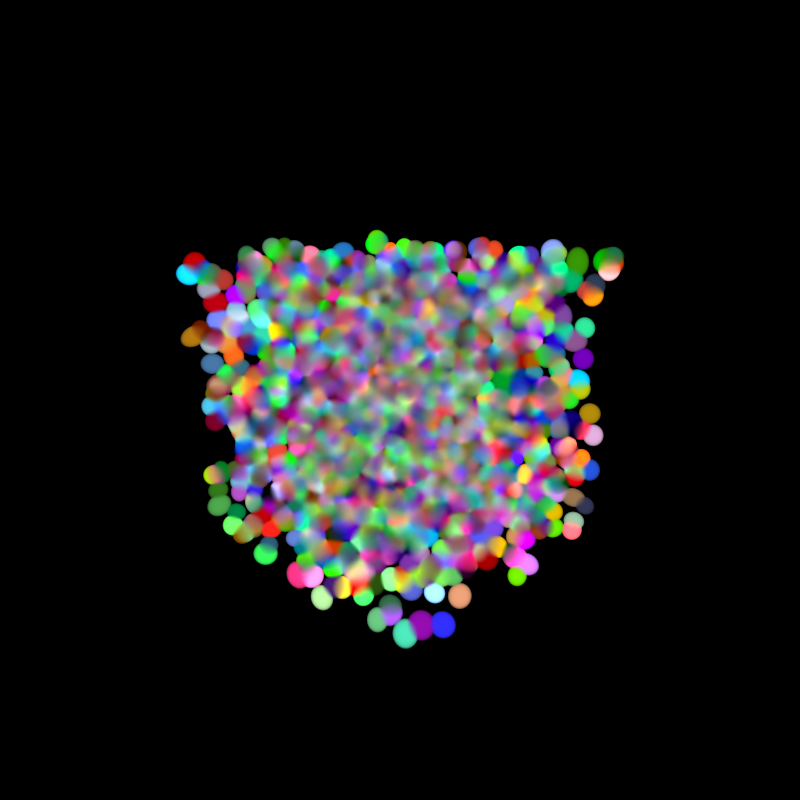

# tt-splat-viewer

A **Rust + wgpu** interactive viewer for the Gaussian-splatting rendering model explored in the
sibling research project [tt-splat](https://github.com/kinginu/tt-splat) — poly-splat + Weighted Sum
Rendering, which is order-independent (no depth sort, no transcendentals).

Native (desktop) + WASM (browser).



> **Scope:** this is a *reference / visual de-risk / demo* tool running on a normal GPU via wgpu.
> It is **not** a performance artifact — the parent project's perf thesis targets Tenstorrent
> Blackhole silicon, which this viewer does not touch. No perf claims come from here. Its job is to
> *see* the tt-splat model on real scenes and de-risk its known weaknesses (depth-free occlusion; scale).

## Usage

```sh
# Interactive viewer (native; needs a display). Drag to orbit, scroll to zoom.
cargo run --release -- path/to/model.ply      # omit the arg for a built-in synthetic scene

# Headless render to a PNG (no display needed):
cargo run --bin offscreen -- model.ply out.png --orbit 45 20   # auto-framed, yaw/pitch in degrees

# Browser (WebGPU) — no native display needed; see CLAUDE.md for the wasm-bindgen + serve steps.
```

With no `.ply`, the viewer shows a procedural demo scene (a ~1200-gaussian colored sphere). The
browser build needs a WebGPU browser (Chrome/Edge, or Safari 17.4+).

A standard INRIA-3DGS `.ply` is rendered through the WSR model directly — see CLAUDE.md §4 on what
that does and does not show.

## Status

The WSR renderer (CPU projection → additive poly-splat quads → fullscreen divide), a standard-3DGS
`.ply` loader, and an orbit camera are implemented and **numerically validated against the PyTorch
reference** — offscreen renders diffed by PSNR (3-gaussian: 50 dB; 2000-gaussian `.ply`: 67 dB; both
within 8-bit rounding). See `validation/`. Next: real captured scenes, faithful tt-splat exports, and
the scale/occlusion explorations.

## License

MIT (see [`LICENSE`](./LICENSE)). Plumbing here (wgpu/WASM init, `.ply` parsing, camera) is currently
original. Per the parent design notes it may later borrow isolated pieces from
[abist-co-ltd/wgpu-gs-viewer](https://github.com/abist-co-ltd/wgpu-gs-viewer) (MIT,
© 2026 株式会社アビスト イノベーションセンター); any such adapted file keeps its original copyright header.
